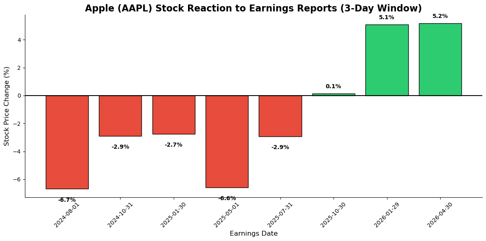

# 🍎 Decoding Apple (AAPL): The Earnings vs. Market Reaction Paradox

### 🎯 Objective
It's a common assumption in retail investing that beating quarterly earnings estimates will automatically trigger a stock price surge. To find out if that's actually true, I built a time-series analysis engine focused specifically on **Apple Inc. (AAPL)**, looking at how the world's most closely-watched stock really reacts to its own financial success.

The goal of this project was to bypass market noise and statistically measure the true stock sentiment surrounding Apple's last 8 quarters of earnings reports.

### 🛠️ Methodology & Code
To ensure data accuracy and avoid API paywalls, I engineered a pipeline using Python and the `yfinance` library to extract and merge historical price action with historical earnings dates. 

* **Data Extraction:** Pulled 5 years of daily AAPL stock prices and the exact dates of their historical earnings releases.
* **Time-Series Engineering:** Because earnings are often released outside of market hours, I wrote a custom iteration loop to find the closest active trading days. 
* **The 4-Day Window:** I calculated the percentage change in Apple's closing price from **1 day prior** to the earnings release to **3 days post-release**, isolating the immediate market reaction.

```python
# Isolating Apple's specific trading window surrounding earnings
aapl_stock = yf.Ticker('AAPL')

# Calculating the precise market reaction window
price_before = df_prices.loc[closest_idx - 1, 'Close']
price_after = df_prices.loc[closest_idx + 3, 'Close']
pct_change = ((price_after - price_before) / price_before) * 100
```
### Visualization 


### 💡 Key Insights: The Apple Paradox
By analyzing the statistical relationship between AAPL's reported earnings and its subsequent stock movement, I uncovered a massive disconnect between company performance and market reaction:

* **The 100% EPS Disconnect:** Across the last 8 quarters, Apple beat its Earnings Per Share (EPS) estimates every single time. However, this performance did not guarantee positive stock momentum.

* **"Buy the Rumor, Sell the News":** Between Q3 2024 and Q3 2025, Apple stock dropped an average of 4.7% following its earnings releases, despite massive EPS surprises. This indicates that institutional investors were heavily pricing in forward-looking guidance rather than rewarding past performance.

* **The Sentiment Reversal:** The market narrative shifted significantly in late 2025 and early 2026. The market finally stopped punishing the stock, rewarding Apple's earnings beats with consistent +5% post-report price jumps.